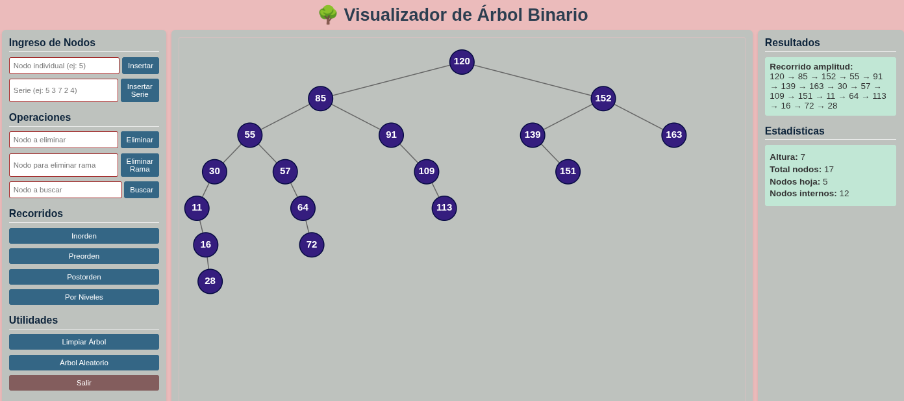

README.md
Implementación Grafica del ADT Árbol Binario de Búsqueda
Autor: `Lorgio Añez J.`
Fecha: 2025-09-22
Descripción: `Aplicacion que representa un árbol binario` con métodos para insertar, buscar, eliminar, recorrer nodos, etc. La representacion del Arbol
se realiza graficamente en una aplicacin WEB, con arquitectura MVC.
Materia: Estructura de Datos II, INF310

## Tarea Unidad 1: Crear interfaz grafica

Requisitos de finalización

Apertura: martes, 2 de septiembre de 2025, 07:00
Cierre: jueves, 11 de septiembre de 2025, 07:00
Realizar la implementacion de una inteface graphics para la representacion de un Arbol Binario.

- La representacion grafica se la tiene que realizar en interfaz web, empleando flask, html, css.
  El proyecto ya fue subido a github para que sirva como base.

Nota: Crear un ambiente grafico que permita llamar a metodos de la clase arbol archivo ZIP.

# Resumen de Funcionalidades - Visualizador de Árboles Binarios

## 📊 MÉTODOS DEL ÁRBOL BINARIO

### Inserción

insertar_nodo(x): Agrega un nodo con valor x (evita duplicados)
\_insertar(): Método auxiliar recursivo para inserción

### Eliminación

eliminar_nodo(x): Elimina un nodo específico manteniendo la estructura BST
eliminar_rama(x): Elimina un nodo y toda su descendencia
\_eliminar(): Método auxiliar para eliminación con reemplazo por sucesor

### Búsqueda

buscar_x(x): Encuentra un nodo por su valor
\_buscar(): Búsqueda recursiva auxiliar

### Recorridos

in_orden(): Izquierdo - Raíz - Derecho (ordenado)
pre_orden(): Raíz - Izquierdo - Derecho
post_orden(): Izquierdo - Derecho - Raíz
amplitud(): Por niveles (usando cola)

### Información

altura(): Calcula la altura máxima del árbol
contar_nodos(): Total de nodos en el árbol
contar_hojas(): Nodos sin hijos
es_vacio(): Verifica si el árbol está vacío
es_hoja(): Verifica si un nodo es hoja

## 🎮 INTERFAZ WEB - BOTONES PRINCIPALES

### Panel Izquierdo - Operaciones

🌱 INSERTAR NODO → Agrega nodo individual
📦 INSERTAR SERIE → Agrega múltiples nodos (ej: "5 3 7")
🗑️ ELIMINAR NODO → Elimina nodo específico
🌿 ELIMINAR RAMA → Elimina nodo y toda su descendencia
🔍 BUSCAR NODO → Encuentra y resalta nodo

#### Recorridos

🔄 INORDEN → Muestra valores ordenados
🔄 PREORDEN → Raíz primero  
🔄 POSTORDEN → Raíz al final
🔄 AMPLITUD → Por niveles

#### Utilidades

🗑️ LIMPIAR ÁRBOL → Reinicia el árbol completo
🎲 ÁRBOL ALEATORIO → Genera árbol con valores random
⚖️ VERIFICAR BALANCE → Chequea balance AVL
🚪 SALIR → Cierra la aplicación

## 🔄 FLUJO DE LA APLICACIÓN

- Usuario interactúa con botones/inputs
- JavaScript envía petición al servidor Flask
- Controlador procesa y modifica el árbol
- Modelo actualiza la estructura del árbol
- JavaScript recibe respuesta y actualiza visualización
- SVG se redibuja automáticamente

### 💾 ALMACENAMIENTO

Memoria del servidor: El árbol persiste durante la sesión
Sin base de datos: No hay persistencia entre reinicios
Una instancia global: Todos los usuarios ven el mismo árbol

### 🎨 VISUALIZACIÓN

- SVG dinámico: Se genera automáticamente
- Nodos circulares con valores numéricos
- Líneas conectadas mostrando parentesco
- Colores diferenciados: Normal, encontrado, eliminado
- Animaciones suaves al insertar/eliminar

### ⚡ CARACTERÍSTICAS TÉCNICAS

- Arquitectura MVC (Modelo-Vista-Controlador)
- Backend: Flask (Python)
- Frontend: HTML5, CSS3, JavaScript vanilla
- Comunicación: API REST JSON
- Visualización: SVG nativo

## Explicacion en Detalle

### Arquitectura MVC (Modelo-Vista-Controlador):

Es un patrón de diseño de software que separa la lógica de la aplicación en tres componentes interconectados.

- Modelo: Se encarga de la lógica de negocio y la gestión de datos (base de datos, consultas, etc.).

- Vista: Es la interfaz de usuario (lo que ve el usuario), en este caso construida con HTML5, CSS3 y JavaScript vanilla.

- Controlador: Actúa como intermediario entre el Modelo y la Vista. Recibe las peticiones del usuario (desde la Vista), interactúa con el Modelo y devuelve la respuesta adecuada a la Vista.

### Backend: Flask (Python):

Flask es un framework ligero de Python para desarrollar aplicaciones web.

Se utiliza para crear el servidor backend, que maneja las peticiones HTTP, la lógica del servidor, y la comunicación con la base de datos si la hay.

### Frontend: HTML5, CSS3, JavaScript vanilla:

- HTML5: Es el lenguaje de marcado para estructurar el contenido web.

- CSS3: Se usa para estilizar y dar diseño a las páginas web.

- JavaScript vanilla: Significa JavaScript puro, sin librerías o frameworks adicionales (como React, Angular, etc.). Se utiliza para añadir interactividad al frontend.

### Comunicación: API REST JSON:

La comunicación entre el frontend y el backend se realiza mediante una API REST (Representational State Transfer), que es un estilo de arquitectura para diseñar redes de comunicación.

Los datos se intercambian en formato JSON (JavaScript Object Notation), que es un formato ligero y fácil de leer y escribir tanto para humanos como para máquinas.

### Visualización: SVG nativo:

SVG (Scalable Vector Graphics) es un formato de gráficos vectoriales que se utiliza para visualizar imágenes y gráficos en la web.

`"Nativo"` significa que se utiliza directamente SVG (por ejemplo, mediante etiquetas `<svg>` en HTML) para renderizar gráficos, en lugar de usar librerías o componentes preconstruidos. Esto permite gráficos escalables y de alta calidad.

- En resumen, esta aplicación web está construida con una arquitectura MVC, utilizando Flask en el backend y tecnologías web estándar (HTML5, CSS3, JavaScript) en el frontend. La comunicación entre frontend y backend es a través de una API REST con JSON, y para la visualización de gráficos se utiliza SVG nativo.
