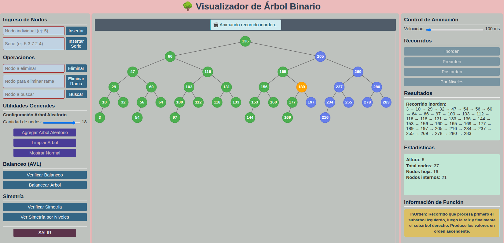
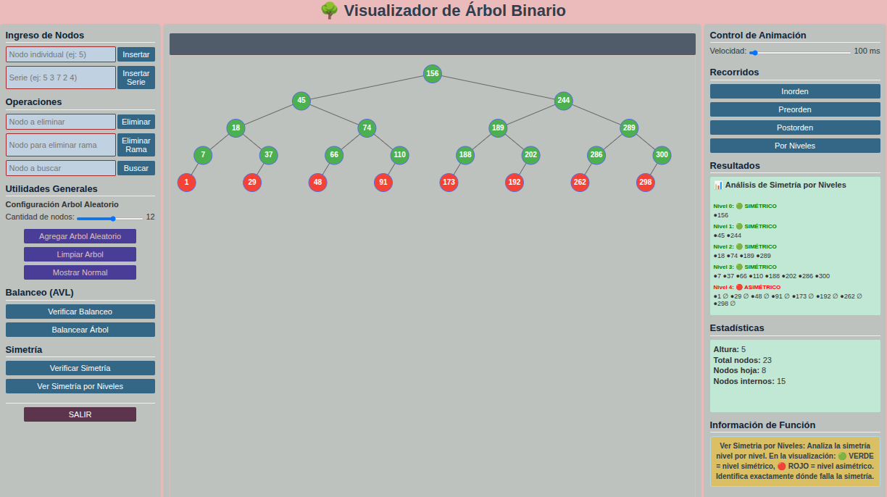
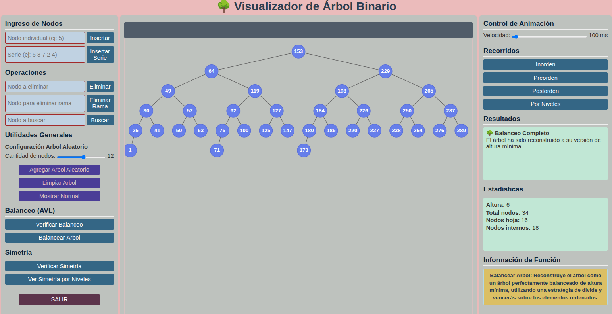

# 🌳 Visualizador Interactivo de Árbol Binario

**Autor:** Lorgio Añez J.  
**Fecha:** 2025-09-23  
**Materia:** Estructura de Datos II, INF310

## 🚀 Demo en Vivo

[**🌐 Visitar la Aplicación Web**](https://lorginho.pythonanywhere.com/)

## 📋 Descripción

Aplicación web interactiva que representa visualmente un **Árbol Binario de Búsqueda** con arquitectura MVC refinada. Permite operaciones completas sobre el árbol con visualización gráfica en tiempo real usando SVG y separación clara de responsabilidades.

## 📸 Galería de Interfaces

#### Animacion InOrden

#### Simetria por Niveles

#### Balancear Arbol

## ✨ Características Principales

### 🔧 Operaciones Básicas

- **🌱 Inserción** individual y por series
- **🗑️ Eliminación** de nodos y ramas completas
- **🔍 Búsqueda** con resaltado visual
- **🔄 Recorridos Animados**: Inorden, Preorden, Postorden, Por Niveles con visualización secuencial

### 📊 Análisis Avanzado

- **🔄 Verificación de Simetría** - Estructural y por niveles
- **⚖️ Balanceo AVL** - Verificación y balanceo automático
- **📈 Estadísticas** en tiempo real (altura, nodos, hojas)

### 🎨 Visualización

- **🎨 SVG Dinámico** con colores por estado
- **📱 Interfaz Responsiva** con tres paneles
- **✨ Recorridos Animados** - Nodos se iluminan en orden de visita
- **🎯 Coloreado por niveles** para análisis de simetría

## 🛠️ Stack Tecnológico

| Capa              | Tecnología                      |
| ----------------- | ------------------------------- |
| **Backend**       | Flask (Python) + Blueprints     |
| **Frontend**      | HTML5, CSS3, JavaScript Vanilla |
| **Visualización** | SVG Nativo                      |
| **Arquitectura**  | MVC Refinado                    |
| **API**           | REST JSON                       |

## 🎮 Panel de Control Completo

### 📥 Operaciones de Entrada

| Botón               | Función                             |
| ------------------- | ----------------------------------- |
| `🌱 INSERTAR NODO`  | Agrega nodo individual              |
| `📦 INSERTAR SERIE` | Múltiples nodos (ej: "5 3 7 2 4")   |
| `🗑️ ELIMINAR NODO`  | Elimina nodo específico             |
| `🌿 ELIMINAR RAMA`  | Elimina nodo y toda su descendencia |
| `🔍 BUSCAR NODO`    | Encuentra y resalta nodo            |
| `🌳 MOSTRAR ÁRBOL`  | Restablece vista a colores normales |

### 🔄 Recorridos Animados

| Tipo           | Comportamiento                                              |
| -------------- | ----------------------------------------------------------- |
| `🔄 INORDEN`   | Muestra lista + anima nodos en orden izquierdo-raíz-derecho |
| `🔄 PREORDEN`  | Muestra lista + anima nodos en orden raíz-izquierdo-derecho |
| `🔄 POSTORDEN` | Muestra lista + anima nodos en orden izquierdo-derecho-raíz |
| `🔄 AMPLITUD`  | Muestra lista + anima nodos por niveles                     |

### ⚡ Utilidades Avanzadas

| Función                   | Descripción                            |
| ------------------------- | -------------------------------------- |
| `⚖️ VERIFICAR BALANCE`    | Chequea balance AVL                    |
| `⚖️ BALANCEAR ÁRBOL`      | Reconstruye a altura mínima            |
| `🔄 VERIFICAR SIMETRÍA`   | Análisis estructural completo          |
| `📊 SIMETRÍA POR NIVELES` | Análisis nivel por nivel con coloreado |
| `🎲 ÁRBOL ALEATORIO`      | Genera árbol con valores random        |
| `🗑️ LIMPIAR ÁRBOL`        | Reinicia completamente                 |
| `🚪 SALIR`                | Cierra la aplicación                   |

## 🏗️ Arquitectura del Sistema Refactorizado

### 📁 Estructura de Proyecto Optimizada

text

arbol_grafico/
├── 🐍 app.py # Punto de entrada
├── 🔗 routes/ # Capa de Rutas HTTP
│ └── arbol_api.py # Blueprints y endpoints REST
├── ⚙️ controllers/ # Lógica pura
│ └── arbol_controller.py # Controlador sin dependencias HTTP
├── 🧠 models/ # Capa de datos
│ ├── arbol_binario.py # Algoritmos arbóreos
│ └── nodo.py # Definición de nodos
├── 👁️ templates/
│ └── index.html # Interfaz de usuario
└── 🎨 static/
├── css/style.css # Estilos responsivos
└── js/script.js # Lógica frontend y SVG

### 🔄 Flujo de Datos con Separación de Responsabilidades

1. **👤 Usuario** → Interactúa con la vista
2. **🎮 JavaScript** → Captura eventos y llama API REST
3. **🔗 Routes (HTTP Layer)** → Maneja requests/responses JSON
4. **⚙️ Controller (Business Logic)** → Ejecuta lógica de aplicación
5. **🧠 Modelo Árbol** → Procesa algoritmos y datos
6. **📡 Respuesta JSON** → Datos estructurados para visualización
7. **🎨 SVG Dinámico** → Actualiza visualización en tiempo real

## 💻 Métodos Implementados

### ⚡ Operaciones Principales

`insertar_nodo(x)` | `eliminar_nodo(x)` | `buscar_x(x)` | `eliminar_rama(x)`

### 📊 Análisis y Recorridos

`in_orden()` | `pre_orden()` | `post_orden()` | `amplitud()` | `altura()` | `contar_nodos()` | `contar_hojas()`

### 🔬 Funcionalidades Avanzadas

`esta_balanceado()` | `forzar_balanceo()` | `es_simetrico()` | `obtener_niveles_simetria()`

## 🎯 Casos de Uso Destacados

### 🔄 Recorridos Animados

- **Un solo click** muestra lista ordenada + animación visual
- **Nodos visitados** se mantienen en verde permanente
- **Nodo actual** se resalta en naranja durante cada paso
- **Máximo valor educativo** para entender algoritmos

### 🎨 Análisis de Simetría

- **Coloreado inteligente** por niveles (🟢 VERDE = simétrico, 🔴 ROJO = asimétrico)
- **Reporte detallado** nivel por nivel en panel de resultados
- **Visualización inmediata** de estructura del árbol

### ⚡ Optimizaciones de Rendimiento

- **Algoritmo O(1)** para coloreado usando Map()
- **Búsqueda eficiente** con mapa de niveles
- **Manejo de estado** optimizado y centralizado
- **Arquitectura desacoplada** para mejor mantenibilidad

## 🚀 Beneficios de MVC

### ✅ Separación Clara de Responsabilidades

- **Routes**: Exclusivamente manejo HTTP y Blueprints
- **Controllers**: Lógica de negocio pura, sin dependencias web
- **Models**: Algoritmos y estructuras de datos independientes

### 🛡️ Mantenibilidad Mejorada

- **Cambios aislados**: Modificaciones en una capa no afectan las otras
- **Testing simplificado**: Cada componente puede probarse independientemente
- **Escalabilidad**: Fácil agregar nuevas características sin romper existentes
