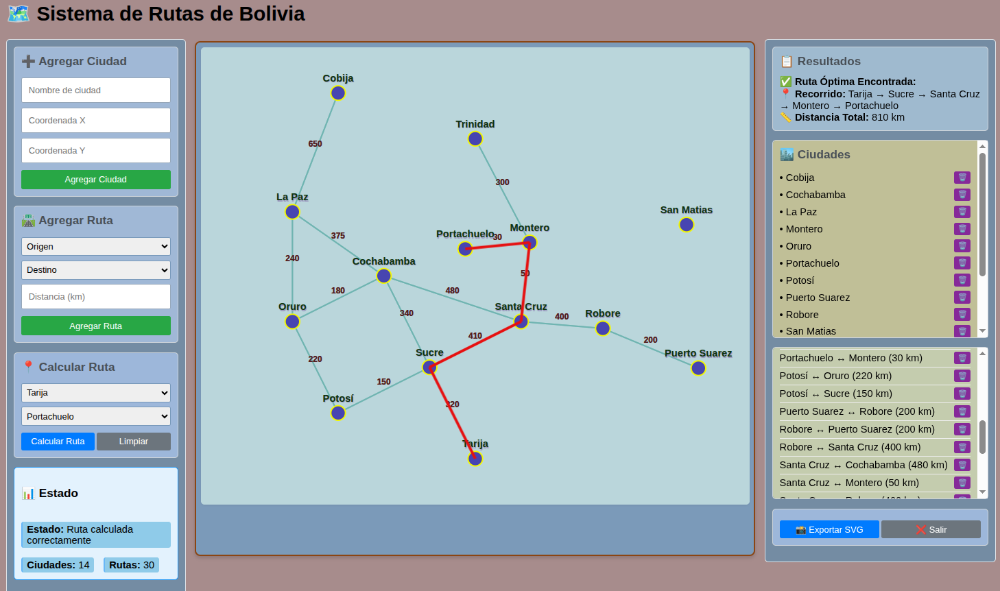
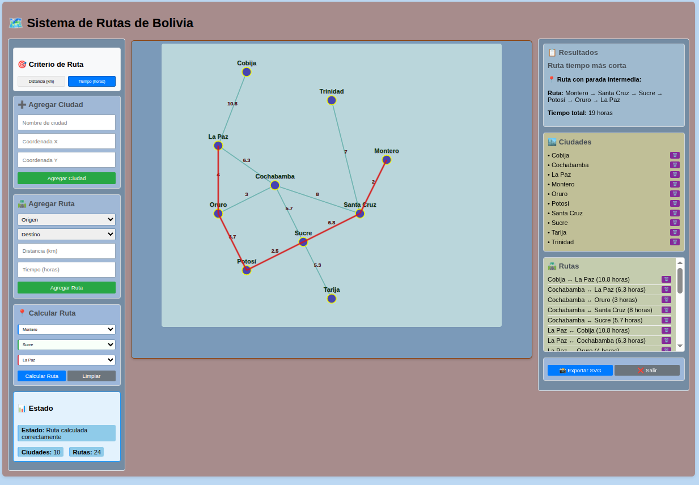
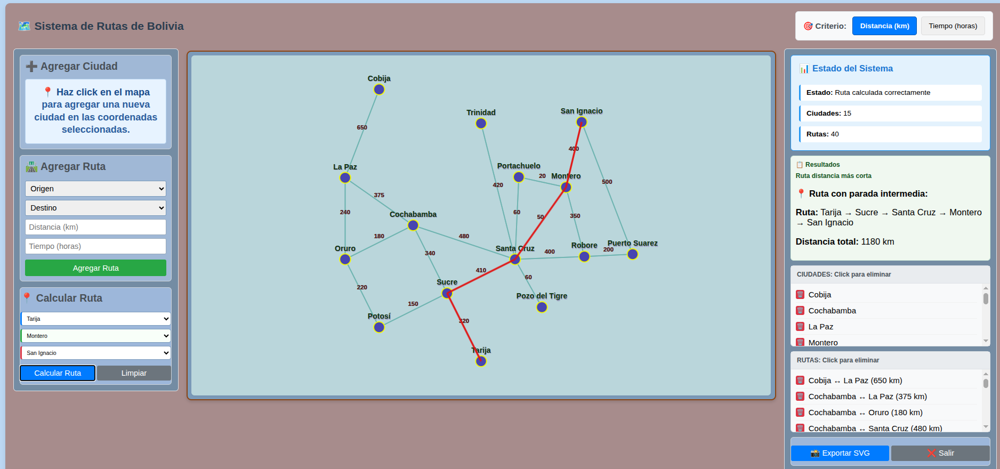

README.md

- Implementación Visual de una Estructura Grafo a traves de una
  Aplicacion WEB de Mapa de Rutas, usando Arquitectura MVC
- Autor: `Lorgio Añez J.`
- Fecha: 2025-10-23
- Materia: Estructura de Datos II, INF310

# 🗺️ Sistema de Rutas de Bolivia - Grafos

## Ruta multiple : Ciudad Origen, Intermedia y Destino Final

Probar en : https://lorginho.pythonanywhere.com/

## En Tiempo

## En Distancia

## 📋 Descripción

Sistema web interactivo para visualizar y calcular rutas óptimas entre ciudades de Bolivia usando teoría de grafos y algoritmo Dijkstra para caminos mínimos.

## 🚀 Características Principales

- **Visualización interactiva** con SVG
- **Cálculo de ruta óptima** con Dijkstra
- **Gestión completa** de ciudades y rutas
- **Exportación SVG** del mapa
- **Arquitectura MVC** con Flask

## 🛠️ Tecnologías

- **Backend:** Python + Flask (servidor, API, algoritmos)
- **Frontend:** HTML5 + SVG + JavaScript (interfaz interactiva)
- **Algoritmo:** Dijkstra con heapq para eficiencia
- **Estilos:** CSS3 (diseño responsive)

## 🏗️ Arquitectura del Sistema

sistema_rutas/
├── 📄 app.py # Punto de entrada principal
├── 📁 controllers/ # Lógica de aplicación
│ └── 📄 mapa_controller.py # Coordina modelo y vista
├── 📁 models/ # Datos y algoritmos
│ └── 📄 grafo_rutas.py # Grafo y algoritmo Dijkstra
├── 📁 views/ # Formateo de respuestas
│ └── 📄 mapa_view.py # Formatea datos para frontend
├── 📁 routes/ # Endpoints API
│ └── 📄 api.py # Definición de rutas REST
├── 📁 templates/ # Interfaz de usuario
│ └── 📄 mapa.html # Página principal HTML
└── 📁 static/ # Recursos estáticos
├── 📄 estilo.css # Estilos y diseño visual
└── 📄 rutas.js # Lógica del frontend

## 📊 Componentes Clave

### Backend (Python/Flask)

- **GrafoRutas:** Representa ciudades y conexiones
- **Dijkstra:** Encuentra camino mínimo con heapq
- **API REST:** /api/mapa, /api/ruta, /api/ciudad

### Frontend (JavaScript/SVG)

- **SistemaRutas:** Gestiona interacción completa
- **SVG integrado:** Mapa manipulable dinámicamente
- **Animaciones:** Visualización de Dijkstra en tiempo real

## 🎯 Uso Rápido

1. **Instalar:** `pip install -r requirements.txt`
2. **Ejecutar:** `python app.py`
3. **Acceder:** `http://localhost:5000`
4. **Calcular ruta:** Seleccionar origen/destino
5. **Exportar:** Click en "Exportar SVG"

## 👥 Autor

Lorgio Añez J. - Proyecto para Estructura de Datos II

# 📚 Glosario de Términos

## 🏗️ Arquitectura y Desarrollo

**MVC (Modelo-Vista-Controlador)**
Patrón arquitectónico que separa la lógica de negocio (Modelo), la interfaz de usuario (Vista) y el control de flujo (Controlador).

**API REST**
Interfaz que permite comunicación entre frontend y backend usando protocolo HTTP y formatos JSON.

**Full-Stack**
Desarrollo que abarca tanto el frontend (cliente) como el backend (servidor) de una aplicación.

## 📊 Estructuras de Datos

**Grafo**
Estructura compuesta por vértices (nodos) y aristas (conexiones) que representan relaciones entre elementos.

**Vértice/Nodo**
Elemento fundamental del grafo. En el proyecto: ciudades.

**Arista**
Conexión entre dos vértices. En el proyecto: rutas entre ciudades.

**Peso**
Valor numérico asociado a una arista. En el proyecto: distancia en kilómetros.

**Grafo No Dirigido**
Grafo donde las aristas no tienen dirección (bidireccionales).

## 🧠 Algoritmos

**Dijkstra**
Algoritmo para encontrar el camino de costo mínimo entre nodos en un grafo con pesos no negativos.

**Heapq**
Módulo de Python que implementa colas de prioridad usando min-heap para eficiencia.

## 🌐 Frontend y Visualización

**SVG (Scalable Vector Graphics)**
Formato de gráficos vectoriales que permite escalado sin pérdida de calidad.

**DOM (Document Object Model)**
Representación en memoria de la estructura HTML que permite manipulación dinámica.

**JSON (JavaScript Object Notation)**
Formato ligero para intercambio de datos entre frontend y backend.

**Event Listener**
Mecanismo que detecta y responde a interacciones del usuario (clics, movimientos).

## 🔧 Tecnologías Específicas

**Flask**
Microframework de Python para desarrollo web rápido y sencillo.

**Python**
Lenguaje de programación utilizado para el backend y algoritmos.

**JavaScript**
Lenguaje de programación para la interactividad del frontend.

**CSS3**
Lenguaje de estilos para diseño y presentación visual.

## 📈 Conceptos de Grafos

**Camino Más Corto**
Ruta con menor número de aristas entre dos nodos.

**Costo Mínimo**
Ruta con menor suma de pesos entre dos nodos.

**Conectividad**
Propiedad que indica si existe camino entre dos nodos cualesquiera.

**Bidireccionalidad**
Característica donde las conexiones funcionan en ambos sentidos.

## 🎯 Términos de la Aplicación

**Ruta Óptima**
Camino con menor distancia total entre origen y destino.

**Exportación SVG**
Funcionalidad para guardar el mapa actual como archivo vectorial.

**Coordenadas**
Posiciones (x, y) que definen la ubicación de ciudades en el mapa.

**Animación Dijkstra**
Visualización en tiempo real del algoritmo encontrando la ruta óptima.

**Cola de Prioridad**
Estructura que siempre devuelve el elemento de mayor prioridad (menor distancia).

## 🔄 Flujos y Procesos

**Request-Response**
Ciclo donde el frontend envía peticiones y el backend devuelve respuestas.

**Serialización**
Proceso de convertir estructuras de datos en formatos transmitibles (como JSON).

**Validación**
Verificación de que los datos de entrada cumplan con los requisitos esperados.

**Renderizado**
Proceso de generar la visualización a partir de los datos.

# 🔄 Flujos de Código - Casos de Uso

## 1. 🏙️ Agregar Ciudad

**Flujo:**

1. Usuario completa formulario o hace click en el mapa
2. Frontend captura datos y envía POST /api/ciudad
3. Backend ejecuta MapaController.agregar_ciudad()
4. Se valida datos con MapaView.validar_datos_ciudad()
5. Modelo ejecuta GrafoRutas.agregar_ciudad()
6. Se retorna respuesta JSON con éxito/error
7. Frontend recarga el mapa completo

## 2. 🛣️ Agregar Ruta

**Flujo:**

1. Usuario selecciona ciudades e ingresa distancia
2. Frontend envía POST /api/ruta/nueva
3. Backend valida existencia de ambas ciudades
4. Modelo ejecuta GrafoRutas.agregar_ruta() bidireccional
5. Se retorna confirmación y actualiza interfaz

## 3. 🧠 Algoritmo Dijkstra

**Flujo:**

1. Inicialización: distancias infinitas, origen en 0
2. Heap: cola prioridad con (0, origen)
3. Procesamiento mientras heap no vacío:
   - Extraer nodo actual (menor distancia)
   - Si es destino → Terminar
   - Para cada vecino calcular nueva distancia
   - Si mejora → Actualizar y agregar a heap
4. Reconstrucción: seguir nodos anteriores desde destino

## 4. 🗑️ Eliminar Elementos

**Eliminar Ciudad:**

1. Usuario click 🗑️ en lista ciudades
2. Frontend envía DELETE /api/ciudad
3. Backend elimina ciudad y TODAS sus rutas conexas
4. Frontend recarga interfaz completa

**Eliminar Ruta:**

1. Usuario click 🗑️ en lista rutas
2. Frontend envía DELETE /api/ruta
3. Backend elimina ambas direcciones de la ruta
4. Frontend remueve línea del SVG

## 5. 📤 Exportar Mapa SVG

**Flujo:**

1. Usuario click "Exportar SVG"
2. JavaScript clona SVG actual
3. Asegura atributos explícitos (colores, visibilidad)
4. Serializa a string XML
5. Crea blob y trigger descarga automática

## 6. 🎯 Calcular Ruta Óptima

**Flujo:**

1. Usuario selecciona origen y destino
2. Frontend envía POST /api/ruta al backend
3. Backend ejecuta Dijkstra en Python
4. Frontend muestra animación en tiempo real
5. Se muestra ruta roja + información detallada

**Visualización:** Nodos amarillos (visitados) → Nodos verdes (actualizados) → Línea roja (ruta óptima)

## 7. 🔄 Comunicación Frontend-Backend

**Flujo API:**

1. Frontend (JavaScript) → fetch('/api/ruta')
2. Backend (Python/Flask) → Dijkstra()
3. Backend procesa algoritmo → JSON response
4. Frontend actualiza SVG → CSS animaciones
5. Usuario ve resultado final

# 📚 Glosario de Términos - Sistema de Rutas

## 🎯 Cola de Prioridad

**Definición:** Estructura de datos que siempre devuelve el elemento de mayor prioridad (en Dijkstra: menor distancia).
**En el proyecto:** Implementada con `heapq` en Python para el algoritmo Dijkstra.
**Funcionamiento:**

- Los elementos se insertan como tuplas `(distancia, ciudad)`
- `heapq.heappop()` siempre extrae el de menor distancia
- Mantiene el orden automáticamente para eficiencia O(log n)
  **Ejemplo:** Cola = `[(0, 'La Paz'), (375, 'Cochabamba'), (240, 'Oruro')]` → Extrae primero `(0, 'La Paz')`

## 🧠 Dijkstra (Algoritmo)

**Definición:** Algoritmo para encontrar el camino de costo mínimo en grafos con pesos no negativos.
**En el proyecto:** Implementado en `GrafoRutas.dijkstra()` para calcular rutas óptimas entre ciudades bolivianas.
**Características:** Usa cola de prioridad (heap), retorna camino, distancia y pasos para animación.
**Ejemplo:** La Paz → Santa Cruz = ['La Paz', 'Cochabamba', 'Santa Cruz'], 855 km

## 📤 Serializar a String XML

**Definición:** Convertir estructura SVG en memoria a texto XML para guardar como archivo.
**En el proyecto:** Usado en `SistemaRutas.exportarMapa()` para exportar el mapa interactivo como archivo .svg descargable.
**Implementación:** `XMLSerializer().serializeToString(clone)` genera texto con etiquetas `<svg><circle>...</svg>`

## 🔄 Reconstrucción (Dijkstra)

**Definición:** Proceso de armado del camino final usando el diccionario de nodos anteriores.
**En el proyecto:** `GrafoRutas._reconstruir_camino()` sigue la cadena desde destino hasta origen y invierte el orden.
**Ejemplo:** `previos = {'Santa Cruz': 'Cochabamba', 'Cochabamba': 'La Paz'}` → Camino: `['La Paz', 'Cochabamba', 'Santa Cruz']`

## 📊 Estructura de Retorno Dijkstra

**Definición:** Diccionario con tres componentes del resultado del algoritmo.
**Componentes:**

- `camino`: Lista ordenada de ciudades (origen → destino)
- `distancia`: Suma total de kilómetros del recorrido óptimo
- `pasos`: Registro detallado para animación en frontend
