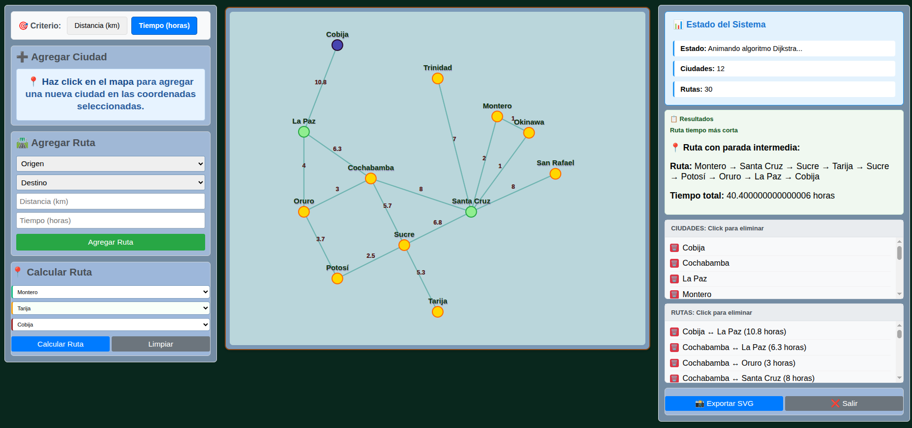
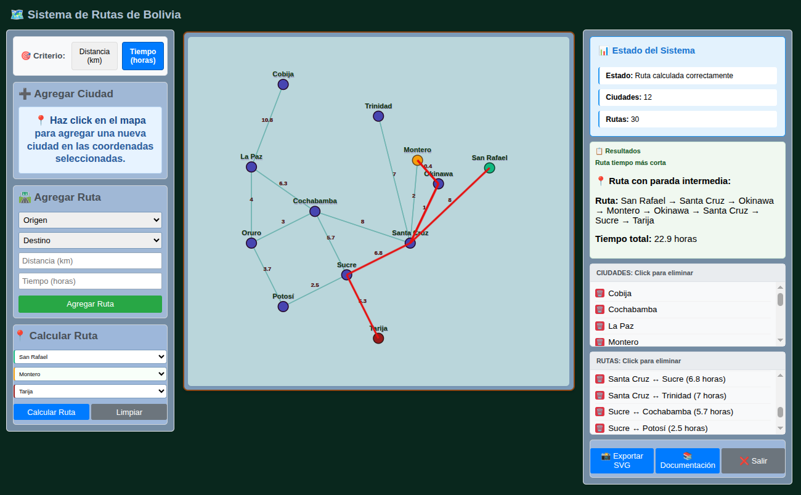
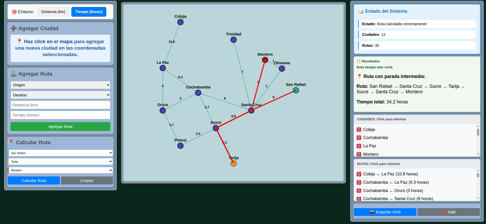

README.md

- Implementación Visual de una Estructura Grafo a través de una Aplicación WEB de Mapa de Rutas, usando Arquitectura MVC
- Autor: `Lorgio Añez J.`
- Fecha: 2025-11-11
- Materia: Estructura de Datos II, INF310

# 🗺️ Sistema de Rutas de Bolivia - Grafos

### Ruta múltiple: Ciudad Origen, Intermedia y Destino

### Animación de Búsqueda (Dijkstra)

### Doble Criterio de Optimización: Distancia y Tiempo

Probar en: <a href="https://lorginho.pythonanywhere.com/" target="_blank">https://lorginho.pythonanywhere.com/</a>


<!-- rutas relativas para ver las imagenes en git hub -->
## Mejor ruta: En Tiempo


<!-- rutas relativas para ver las imagenes en git hub -->

## Mejor ruta: En Distancia


<!--
rutas relativas para ver las imagenes en git hub
./static/sistema_rutas_distancia.png
-->

## 📋 Descripción

Sistema web interactivo para visualizar y calcular rutas óptimas entre ciudades de Bolivia usando teoría de grafos y algoritmo Dijkstra para caminos mínimos con **doble criterio de optimización**.

## 🚀 Características Principales

- **Visualización interactiva** con SVG
- **Cálculo de ruta óptima** con Dijkstra para **distancia y tiempo**
- **Gestión completa** de ciudades y rutas
- **Exportación SVG** del mapa
- **Arquitectura MVC** con Flask
- **Interfaz moderna** con controles intuitivos
- **Animación en tiempo real** del algoritmo Dijkstra
- **Doble criterio** de búsqueda (distancia/tiempo)
- **Rutas con puntos intermedios** para planificación compleja
- **Colores distintivos en rutas:** Visualización con colores específicos para origen (verde esmeralda), intermedia (ámbar) y destino (borgonia)

## 🛠️ Tecnologías

- **Backend:** Python + Flask (servidor, API, algoritmos)
- **Frontend:** HTML5 + SVG + JavaScript (interfaz interactiva)
- **Algoritmo:** Dijkstra con heapq para eficiencia
- **Estilos:** CSS3 (diseño responsive)

## 🏗️ Arquitectura del Sistema

sistema_rutas/

- ├── 📄 app.py # Punto de entrada principal
- ├── 📁 controllers/ # Lógica de aplicación
- └── 📄 mapa_controller.py # Coordina modelo y vista
- ├── 📁 models/ # Datos y algoritmos
- │ └── 📄 grafo_rutas.py # Grafo y algoritmo Dijkstra con doble peso
- ├── 📁 views/ # Formateo de respuestas
- │ └── 📄 mapa_view.py # Formatea datos para frontend
- ├── 📁 routes/ # Endpoints API
- │ └── 📄 api.py # Definición de rutas REST
- ├── 📁 templates/ # Interfaz de usuario
- │ └── 📄 mapa.html # Página principal HTML
- └── 📁 static/ # Recursos estáticos
- ├── 📄 estilo.css # Estilos y diseño visual
- └── 📄 rutas.js # Lógica del frontend

# 📘 Glosario de la Arquitectua

---

## `app.py`

Archivo principal de la aplicación. Actúa como **punto de entrada**, inicializando la configuración, los servicios y el servidor web.

## 📁 controllers/

Contiene la **lógica de aplicación**, coordinando la interacción entre modelos y vistas.

### `mapa_controller.py`

Gestiona la comunicación entre el **grafo de rutas** (modelo) y la **vista**, procesando solicitudes y preparando datos para el frontend.

---

## 📁 models/

Incluye las definiciones de **estructuras de datos, lógica central y algoritmos**.

### `grafo_rutas.py`

Implementa el **grafo de rutas** y el algoritmo **Dijkstra con doble peso** (por ejemplo, distancia y tiempo). Maneja cálculos y relaciones.

---

## 📁 views/

Define el **formateo de la salida** enviada al usuario o frontend.

### `mapa_view.py`

Convierte los datos procesados por el controlador a un formato adecuado (generalmente JSON) para el cliente web.

---

## 📁 routes/

Contiene la definición de los **endpoints de la API**, siguiendo el estilo REST.

### Estilo `REST`

El estilo REST (Transferencia de Estado Representacional) es un estilo arquitectónico para diseñar sistemas distribuidos, comúnmente utilizado para crear APIs web. Sus principios incluyen la interfaz uniforme, la ausencia de estado (el estado se guarda en el cliente), la escalabilidad, la posibilidad de crear arquitecturas en capas y el uso de REST, que establece una serie de restricciones para que los sistemas se comuniquen usando métodos como GET y POST sobre recursos identificados por URLs, y con representaciones de datos en formatos como JSON.

---

### `api.py`

Configura las **rutas del servidor**, mapeando URLs a funciones controladoras y definiendo los métodos HTTP disponibles.

---

## 📁 templates/

Guarda las **plantillas HTML** que componen la interfaz gráfica de usuario.

### `mapa.html`

Página principal de la aplicación. Muestra el mapa y la interfaz interactiva.

---

## 📁 static/

Carpeta de **recursos estáticos** usados por el frontend (CSS, JS, imágenes).

### `estilo.css`

Define la **apariencia visual**: colores, diseño, espaciados y estilos generales.

### `rutas.js`

Contiene la **lógica del frontend**, obtiene datos de la API y actualiza la interfaz del mapa.

---

## 🎨 Interfaz de Usuario

### Header Principal

- **Título del sistema** + Selector de criterio (Distancia/Tiempo) alineado a la derecha
- **Criterios de búsqueda:** Botones grandes y visibles para alternar entre distancia (km) y tiempo (horas)

### Panel Izquierdo (Controles)

- **Agregar Ruta:** Formulario para conectar ciudades existentes con distancia y tiempo
- **Calcular Ruta:** Selectores para origen, destino y punto intermedio opcional
- **Instrucciones:** Guía visual prominente para agregar ciudades haciendo click en el mapa

### Panel Central (Mapa Interactivo)

- **Visualización SVG:** Mapa escalable de Bolivia con ciudades y rutas
- **Pesos dinámicos:** Las rutas muestran distancia o tiempo según el criterio seleccionado
- **Interacción:** Click en cualquier área del mapa para agregar nuevas ciudades
- **Animaciones:** Visualización en tiempo real del algoritmo Dijkstra
- **Colores de ruta óptima:**
  - 🟢 **Origen:** Verde esmeralda (#10b981)
  - 🟡 **Intermedia:** Ámbar (#f59e0b)
  - 🔴 **Destino:** Borgonia (#991b1b)

### Panel Derecho (Información y Gestión)

- **Estado del Sistema:** Información en tiempo real del grafo con texto grande
- **Resultados:** Detalles de rutas calculadas según criterio seleccionado
- **Listas gestionables:** Ciudades y rutas con opciones de eliminación y scroll optimizado
- **Controles globales:** Exportación SVG y cierre de aplicación

## 📊 Componentes Clave

### Backend (Python/Flask)

- **GrafoRutas:** Representa ciudades y conexiones con pesos duales (distancia/tiempo)
- **Dijkstra parametrizado:** Encuentra camino mínimo según criterio seleccionado
- **API REST:** /api/mapa, /api/ruta, /api/ciudad

### Frontend (JavaScript/SVG)

- **SistemaRutas:** Gestiona interacción completa con cambio dinámico de criterios
- **SVG responsive:** Mapa manipulable dinámicamente con actualización de pesos
- **Animaciones:** Visualización de Dijkstra en tiempo real
- **Gestión de estado:** Limpieza automática entre operaciones
- **Sistema de colores:** Identificación visual instantánea de roles en rutas calculadas
- **Armonización cromática:** Colores coordinados entre selectores del panel y nodos del mapa

## 🎯 Uso Rápido

1. **Instalar:** `pip install -r requirements.txt`
2. **Ejecutar:** `python app.py`
3. **Acceder:** `http://localhost:5000`
4. **Seleccionar criterio:** Usar botones en el header (Distancia/Tiempo)
5. **Agregar ciudades:** Hacer click en el mapa en la ubicación deseada
6. **Agregar rutas:** Usar formulario en panel izquierdo para conectar ciudades (ingresar distancia y tiempo)
7. **Calcular ruta:** Seleccionar origen, destino (y opcionalmente punto intermedio)
8. **Exportar:** Click en "Exportar SVG" para guardar el mapa

## 🔧 Funcionalidades Avanzadas

### Doble Criterio de Optimización

- **Distancia:** Optimiza por menor kilometraje total (km)
- **Tiempo:** Optimiza por menor duración del viaje (horas)
- **Cambio instantáneo:** Actualización en tiempo real de toda la visualización
- **Persistencia visual:** El mapa y listas se redibujan automáticamente al cambiar criterio

### Sistema de Colores para Rutas

- **Identificación visual inmediata** de ciudades en rutas calculadas
- **Colores armonizados** con la interfaz existente
- **Persistencia visual** que sobrevive a animaciones y limpiezas
- **Coordinación** entre bordes de selectores y colores de nodos

### Estructura de Grafo con Pesos Duales

```python
# Ejemplo de estructura de datos para rutas
rutas = {
    'La Paz-Cochabamba': {
        'distancia': 375,  # en kilómetros
        'tiempo': 6.3      # en horas
    },
    'Cochabamba-Santa Cruz': {
        'distancia': 480,
        'tiempo': 8.0
    }
}
```

### Cálculo de Rutas con Punto Intermedio

- Seleccionar ciudad origen, intermedia y destino
- El sistema calcula la ruta óptima considerando la parada intermedia
- Visualización unificada del camino completo
- Compatible con ambos criterios (distancia/tiempo)

### Gestión Intuitiva del Grafo

- **Agregar ciudades:** Click directo en el mapa (sin formulario manual)
- **Eliminar elementos:** Botones 🗑️ en listas del panel derecho
- **Scroll optimizado:** Listas compactas con scrollbars anchos (14px)
- **Feedback visual:** Animaciones y estados claros con texto de gran tamaño

## 👥 Autor

Lorgio Añez J. - Proyecto para Estructura de Datos II

# 📚 Glosario de Términos

## 🏗️ Arquitectura y Desarrollo

**MVC (Modelo-Vista-Controlador)**  
Patrón arquitectónico que separa la lógica de negocio (Modelo), la interfaz de usuario (Vista) y el control de flujo (Controlador).

**API REST**  
Interfaz que permite comunicación entre frontend y backend usando protocolo HTTP y formatos JSON.

## 📊 Estructuras de Datos

**Grafo con Pesos Múltiples**  
Estructura compuesta por vértices (nodos) y aristas (conexiones) que almacena múltiples valores de peso para cada conexión.

**Peso Dual**  
Valores numéricos asociados a una arista. En el proyecto: distancia en kilómetros Y tiempo en horas.

## 🧠 Algoritmos

**Dijkstra Parametrizado**  
Algoritmo para encontrar el camino de costo mínimo entre nodos en un grafo, configurable por tipo de peso (distancia o tiempo).

## 🎯 Términos de la Aplicación

**Ruta Óptima Configurable**  
Camino con menor distancia total O menor tiempo total entre origen y destino, según selección del usuario.

# 🔄 Flujos de Código - Casos de Uso

## 1. 🏙️ Agregar Ciudad

**Flujo:**

1. Usuario hace click en el mapa
2. Frontend captura coordenadas (x, y) y solicita nombre de ciudad
3. Frontend envía POST /api/ciudad con {nombre, x, y}
4. Backend ejecuta MapaController.agregar_ciudad()
5. Se valida datos con MapaView.validar_datos_ciudad()
6. Modelo ejecuta GrafoRutas.agregar_ciudad(nombre, x, y)
7. Se retorna respuesta JSON con éxito/error
8. Frontend recarga el mapa completo

## 2. 🛣️ Agregar Ruta con Pesos Duales

**Flujo:**

1. Usuario selecciona ciudad1, ciudad2 e ingresa distancia (km) y tiempo (horas)
2. Frontend envía POST /api/ruta/nueva con {ciudad1, ciudad2, distancia, tiempo}
3. Backend valida existencia de ambas ciudades
4. Modelo ejecuta GrafoRutas.agregar_ruta() bidireccional con objeto de pesos
5. Se retorna confirmación y actualiza interfaz
6. Frontend redibuja rutas según criterio actual

## 3. 🧠 Algoritmo Dijkstra con Criterio Configurable

**Flujo:**

1. Usuario selecciona criterio (distancia/tiempo) en frontend
2. Inicialización: distancias infinitas, origen en 0
3. Heap: cola prioridad con (0, origen)
4. Procesamiento mientras heap no vacío:

   - Extraer nodo actual (menor distancia/tiempo según criterio)
   - Si es destino → Terminar
   - Para cada vecino calcular nueva distancia/tiempo usando peso correspondiente
   - Si mejora → Actualizar y agregar a heap

5. Reconstrucción: seguir nodos anteriores desde destino

## 4. 🔄 Cambio de Criterio de Visualización

**Flujo:**

1. Usuario hace click en botón "Distancia" o "Tiempo" en header
2. Frontend actualiza variable criterioActual y estilos de botones
3. Se ejecuta limpieza automática de ruta anterior
4. Se redibujan todas las rutas en el mapa con nuevos pesos
5. Se actualiza lista de rutas en panel derecho con nuevos valores
6. Los pesos mostrados cambian instantáneamente en toda la interfaz

## 5. 🗑️ Eliminar Elementos

**Eliminar Ciudad:**

1. Usuario click 🗑️ en lista ciudades
2. Frontend envía DELETE /api/ciudad con {nombre}
3. Backend elimina ciudad y TODAS sus rutas conexas
4. Frontend recarga interfaz completa

**Eliminar Ruta:**

1. Usuario click 🗑️ en lista rutas
2. Frontend envía DELETE /api/ruta con {ciudad1, ciudad2}
3. Backend elimina ambas direcciones de la ruta
4. Frontend actualiza la visualización

## 6. 📤 Exportar Mapa SVG

**Flujo:**

1. Usuario click "Exportar SVG"
2. JavaScript clona SVG actual
3. Asegura atributos explícitos (colores, visibilidad)
4. Serializa a string XML
5. Crea blob y trigger descarga automática

## 7. 🎯 Calcular Ruta Óptima con Criterio

**Flujo:**

1. Usuario selecciona origen y destino (opcionalmente punto intermedio)
2. Usuario selecciona criterio (distancia/tiempo)
3. Frontend envía POST /api/ruta al backend con {origen, destino, intermedio, criterio}
4. Backend ejecuta Dijkstra en Python usando el criterio especificado
5. Frontend muestra animación en tiempo real
6. Se muestra ruta roja + información detallada según criterio

**Visualización Animacion:** Nodos amarillos (visitados) → Nodos verdes (actualizados) → Línea roja (ruta óptima)

**Visualización Caculo de Ruta :** Nodos con colores según rol → 🟢 Origen → 🟡 Intermedia → 🔴 Destino

## 8. 🔄 Comunicación Frontend-Backend

**Flujo API:**

1. Frontend (JavaScript) → fetch('/api/ruta') con criterio
2. Backend (Python/Flask) → Dijkstra(criterio)
3. Backend procesa algoritmo con pesos correspondientes → JSON response
4. Frontend actualiza SVG → CSS animaciones
5. Usuario ve resultado final según criterio seleccionado

# 📚 Glosario de Términos - Sistema de Rutas

## 🎯 Cola de Prioridad con Criterio

**Definición:** Estructura de datos que siempre devuelve el elemento de mayor prioridad (en Dijkstra: menor distancia O menor tiempo según criterio).  
**En el proyecto:** Implementada con `heapq` en Python para el algoritmo Dijkstra parametrizado.  
**Funcionamiento:**

- Los elementos se insertan como tuplas `(valor, ciudad)` donde valor es distancia o tiempo
- `heapq.heappop()` siempre extrae el de menor valor según el criterio activo
- Mantiene el orden automáticamente para eficiencia O(log n)

**Ejemplo con distancia:** Cola = `[(0, 'La Paz'), (375, 'Cochabamba'), (240, 'Oruro')]` → Extrae primero `(0, 'La Paz')`  
**Ejemplo con tiempo:** Cola = `[(0, 'La Paz'), (6.3, 'Cochabamba'), (4.0, 'Oruro')]` → Extrae primero `(0, 'La Paz')`

## 🧠 Dijkstra Parametrizado (Algoritmo)

**Definición:** Algoritmo para encontrar el camino de costo mínimo en grafos con pesos múltiples, configurable por tipo de peso.  
**En el proyecto:** Implementado en `GrafoRutas.dijkstra(origen, destino, criterio)` para calcular rutas óptimas según distancia o tiempo.  
**Características:** Usa cola de prioridad (heap), retorna camino, valor total y pasos para animación.  
**Ejemplo distancia:** La Paz → Santa Cruz = ['La Paz', 'Cochabamba', 'Santa Cruz'], 855 km  
**Ejemplo tiempo:** La Paz → Santa Cruz = ['La Paz', 'Cochabamba', 'Santa Cruz'], 14.3 horas

## 📊 Estructura de Pesos Duales

**Definición:** Objeto que almacena múltiples métricas para cada conexión en el grafo.  
**En el proyecto:** Implementado como diccionario con claves 'distancia' y 'tiempo' para cada ruta.  
**Ejemplo:**

python

pesos_ruta = {
'distancia': 375, # kilómetros
'tiempo': 6.3 # horas
}

## 🔄 Reconstrucción (Dijkstra)

**Definición:** Proceso de armado del camino final usando el diccionario de nodos anteriores.  
**En el proyecto:** `GrafoRutas._reconstruir_camino()` sigue la cadena desde destino hasta origen y invierte el orden.  
**Ejemplo:** `previos = {'Santa Cruz': 'Cochabamba', 'Cochabamba': 'La Paz'}` → Camino: `['La Paz', 'Cochabamba', 'Santa Cruz']`

## 📤 Serializar a String XML

**Definición:** Convertir estructura SVG en memoria a texto XML para guardar como archivo.  
**En el proyecto:** Usado en `SistemaRutas.exportarMapa()` para exportar el mapa interactivo como archivo .svg descargable.  
**Implementación:** `XMLSerializer().serializeToString(clone)` genera texto con etiquetas `<svg><circle>...</svg>`

## 📊 Estructura de Retorno Dijkstra

**Definición:** Diccionario con tres componentes del resultado del algoritmo.  
**Componentes:**

- `camino`: Lista ordenada de ciudades (origen → destino)
- `distancia`/`tiempo`: Suma total del recorrido óptimo según criterio
- `pasos`: Registro detallado para animación en frontend
- `criterio`: Tipo de optimización utilizada (distancia/tiempo)
